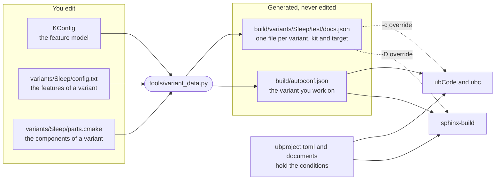

# Variant management in SPLed

A guide by use case: how to look at a variant, how to see what a change does, and how to write
documentation that depends on the variant.

SPLed builds five product variants from one code base, and its documentation works the same way.
One set of documents describes every variant, and **data decides what one variant shows**. No
document is a template, and nothing in `conf.py` or CMake decides what a page contains:

- a **variant data file** per variant says which features are on and which components are in;
- **conditions** in `ubproject.toml` and in the documents read that file;
- **Sphinx** and **ubCode**, with its command-line tool `ubc`, read the same files, so the editor
  shows what the build produces.

| I want to … | Use case |
| --- | --- |
| set up and generate the variant data | [1](#1-set-up-a-documentation-environment), [2](#2-generate-the-variant-data) |
| know which variant I am looking at | [3](#3-see-which-variant-you-are-working-on) |
| switch the variant my editor shows | [4](#4-switch-the-variant-your-editor-shows) |
| look at another variant without switching | [5](#5-look-at-another-variant-without-switching) |
| see what differs between two variants | [6](#6-see-what-differs-between-two-variants) |
| try a change without touching the product | [7](#7-try-a-change-without-touching-the-product) |
| understand what ubCode shows me | [8](#8-know-what-ubcode-shows-you) |
| make a paragraph, requirement or diagram depend on a feature | [9](#9-make-content-depend-on-a-feature) |
| print a variant value in the text | [10](#10-print-a-variant-value-in-the-text) |
| show a section only in the reports build | [11](#11-show-a-section-only-in-the-reports-build) |
| include a document only when its component is in the variant | [12](#12-include-a-document-only-when-its-component-is-in-the-variant) |
| put one document in different places per variant | [13](#13-place-one-document-differently-per-variant) |
| add a component, a feature or a variant | [14](#14-add-a-component), [15](#15-add-or-change-a-feature), [16](#16-add-a-variant) |
| check my work, or find out why something is missing | [17](#17-run-the-checks), [18](#18-when-something-looks-wrong) |

New to SPLed? Go through use cases 1 to 8 once, in order.

## The idea in one picture



## Words you will meet

| Word | Meaning in SPLed |
| --- | --- |
| **Variant** | A product configuration: `Disco`, `Sleep`, `Spa`, `IDEA/Sloemada` or `Base/Dev`. Each is a folder under `variants/`. |
| **Feature** | A switch or value of the feature model `KConfig`, such as `BLINKING` or `CUSTOMER`. A variant sets its features in its `config.txt`. |
| **Component** | A folder under `components/`, plus the integration suite `test/spled_integration`. A variant lists its components in its `parts.cmake`. |
| **Kit** | `prod`, the product, or `test`, which adds unit tests, coverage and, for Disco, the integration suite. |
| **Target** | `docs`, the documents, or `reports`, the documents plus test results and coverage. |
| **Variant data file** | `build/variants/<variant>/<kit>/<target>.json`, one per combination: 5 variants × 2 kits × 2 targets = 20 files. |
| **Pointer** | `build/autoconf.json`, a copy of the variant data file you are working on. ubCode and a plain `sphinx-build` read it. |
| **150 % documentation** | Every document of every variant lives in the tree. Conditions remove what one variant does not have. |
| **`var.*`** | How a condition reads the variant data: `var.features.BLINKING`, `var.build_config.components`. |

## What a variant data file contains

`build/variants/Sleep/test/docs.json`, shortened:

```json
{
  "build_config": {
    "components": ["components/platform_types", "components/rte", "…", "components/brightness_controller", "components/auto_off"],
    "kit": "test",
    "target": "docs",
    "variant": "Sleep"
  },
  "features": {
    "AUTO_OFF": true,
    "AUTO_OFF_PERIOD_SECONDS": 10,
    "BLINKING": false,
    "BRIGHTNESS_ADJUSTMENT_MANUAL": true,
    "CUSTOMER": "B"
  }
}
```

- `features` holds every symbol of the feature model with this variant's value. Booleans are
  `true` or `false`, numbers are numbers, strings are strings. Every boolean is present, also
  the ones that are off, so a condition on it always has an answer.
- `build_config.components` is the variant's component list, read from its `parts.cmake`.
- `build_config.variant`, `kit` and `target` say which combination the file describes.

Everything under `build/` is generated, and nobody edits it; VS Code opens it read-only. To change
a variant, change its sources ([15](#15-add-or-change-a-feature), [16](#16-add-a-variant)), or
try a change on a copy ([7](#7-try-a-change-without-touching-the-product)).

## Setup

### 1. Set up a documentation environment

You need Python 3.12 and the locked Python dependencies. Nothing in this guide needs a compiler.

- **Full toolchain**, to build the firmware as well: follow [Start developing](README.md#start-developing).
- **Documentation only**, the same steps the CI documentation job runs:

  ```bash
  pipx install poetry==2.4.1
  POETRY_VIRTUALENVS_IN_PROJECT=true poetry install --no-root   # creates .venv
  source .venv/bin/activate
  ```

  On Windows, run `$env:POETRY_VIRTUALENVS_IN_PROJECT = "true"` before `poetry install --no-root`,
  and activate with `.venv\Scripts\Activate.ps1`.

For the editor, install the **ubCode** extension (`useblocks.ubcode`) in VS Code and open the
repository folder. ubCode reads `ubproject.toml`; there is nothing else to configure. The
command-line tool `ubc` ships inside the extension, in `server/cli/` under the extension's folder
in `~/.vscode/extensions/`. Put that folder on your `PATH`.

All commands below run from the repository root, with the virtualenv activated.

### 2. Generate the variant data

```bash
python tools/variant_data.py --all
```

- This writes all 20 variant data files under `build/variants/`, from `KConfig`, each variant's
  `config.txt` and each variant's `parts.cmake`. KConfig is pure Python, so it needs neither a
  compiler nor CMake.
- Run it again whenever `KConfig`, a `config.txt` or a `parts.cmake` changes.
  `python tools/variant_data.py --all --check` tells you whether the files are up to date; CI runs
  it.
- Configuring a CMake build, with the build scripts or the CMake extension, writes the files of the
  variant it configures, and makes that variant the current one ([4](#4-switch-the-variant-your-editor-shows)).

## Explore

### 3. See which variant you are working on

The pointer says it:

```bash
python -c "import json; c = json.load(open('build/autoconf.json'))['build_config']; print(c['variant'], c['kit'], c['target'])"
```

```text
Disco test docs
```

The documentation says it as well: its start page shows **Variant: Disco**. The page takes that
from the variant data file ([10](#10-print-a-variant-value-in-the-text)).

### 4. Switch the variant your editor shows

- **In VS Code:** *Terminal → Run Task… → Select documentation variant*, then pick the variant
  and the kit.
- **On the command line:**

  ```bash
  python tools/variant_data.py --variant Sleep --kit test --current
  ```

Both copy the chosen variant's `docs` file to `build/autoconf.json`, so ubCode and a plain
`sphinx-build` now read Sleep. If the editor still shows the previous variant, reload the window
(*Command Palette → Developer: Reload Window*).

- The kit defaults to `prod`. Give `--kit test` for the test kit.
- Configuring a CMake build makes the same switch, to the variant you configure.
- The pointer always holds a `docs` file, so in the editor the report-only sections are inactive
  ([11](#11-show-a-section-only-in-the-reports-build)).

### 5. Look at another variant without switching

You do not have to switch to look at a variant. Point the reader at its file instead.

- **The rendered documentation (Sphinx):**

  ```bash
  python -m sphinx -b html -D needs_variant_data_file=build/variants/Sleep/test/docs.json . build/docs/Sleep
  ```

  Then open `build/docs/Sleep/index.html`. A build takes a few seconds. In VS Code, the task
  *Build documentation for a variant* does the same, and also puts the variant's name in the page
  title.
- **ubCode's view (ubc):**

  ```bash
  ubc check -c "needs.variant_data_file = 'build/variants/Sleep/test/docs.json'"
  ```

  Each `info[toctree.variant_excluded]` line names a document this variant leaves out, and the
  rule that removed it. `ubc check` also lists the project's other warnings, so its exit code says
  nothing about the variant.

`-D` for Sphinx and `-c` for ubc override the same setting, `variant_data_file`. spl-core passes
the same `-D` when CMake builds the `docs` and `reports` targets.

### 6. See what differs between two variants

Build both variants as in [5](#5-look-at-another-variant-without-switching), then compare them.

- **Pages.** Sleep has pages for `auto_off` and `brightness_controller`, and Disco does not. On
  the light controller page, Disco shows the blinking state diagram and Sleep does not.
- **Needs.** Every HTML build also writes a `needs.json` next to its `index.html`. `ubc diff`
  compares two of them:

  ```bash
  ubc diff -n build/docs/Disco/needs.json -n build/docs/Sleep/needs.json
  ```

  Or skip the builds and compare the current variant with another one directly:

  ```bash
  ubc diff -c "needs.variant_data_file = 'build/variants/Sleep/test/docs.json'"
  ```

  The output lists every need that is new, removed or changed. For Disco against Sleep, it starts
  with `New need SWDD_AO-100`, the first of the auto-off requirements that only Sleep has.

### 7. Try a change without touching the product

Do not edit a variant data file. It is generated, and the next run overwrites it. For a what-if,
use one of these, from the quickest to the most complete:

1. **One value, in ubc.** Override the value on the command line:

   ```bash
   ubc diff -c "needs.variant_data.features.BLINKING = false"
   ```

   With Disco as the current variant this prints `Removed need SWDD_LC-101` and
   `Removed need SWDD_LC-203`, the two blinking requirements. The same `-c` works with `ubc check`
   and `ubc build needs`.
2. **Any change, in both readers.** Copy a variant data file to a folder outside `build/`, edit
   the copy, and point the readers at it:

   ```bash
   cp build/variants/Disco/test/docs.json /tmp/what-if.json   # now edit /tmp/what-if.json
   python -m sphinx -b html -D needs_variant_data_file=/tmp/what-if.json . build/docs/what-if
   ubc check -c "needs.variant_data_file = '/tmp/what-if.json'"
   ```

   On Windows, use any folder outside `build/` instead of `/tmp`.
3. **The real change.** Change the variant itself, in its `config.txt` or `parts.cmake`
   ([15](#15-add-or-change-a-feature), [16](#16-add-a-variant)), regenerate with
   `python tools/variant_data.py --all`, and look again. This changes the product, so revert it if
   it was only an experiment.

### 8. Know what ubCode shows you

- **Inactive blocks are faded, not hidden.** The editor fades the source of an `{if}` block whose
  condition is false, the way a C editor fades code under a false `#if`. The preview shows the
  block collapsed and greyed, labelled with its condition. Its needs are still left out of the
  index, as in the Sphinx build.
- **Left-out documents are information, not errors.** The components page lists every component
  ([12](#12-include-a-document-only-when-its-component-is-in-the-variant)). An entry for a
  component the variant does not have is reported as `toctree.variant_excluded`, with the rule
  that removed the document.
- **No generated report pages.** Test results and coverage exist only after a CMake build of the
  `reports` target. ubCode does not follow the `generated` link to them, and the pointer holds a
  `docs` file anyway.

ubCode's side is described in [ubCode's guide to variants](https://ubcode.useblocks.com/usage/variants.html).

## Write

### 9. Make content depend on a feature

Wrap the content in the `if` directive of Sphinx-Needs. Its condition is a Python expression over
`var.*`.

In Markdown, use a fence of four backticks, so that the block can hold directives with three:

`````markdown
````{if} var.features.BLINKING
```{spec} Blinking Behavior
:id: SWDD_LC-101

...
```
````
`````

In reStructuredText:

```rst
.. if:: var.features.BLINKING

   This paragraph exists only in variants with blinking.
```

- There is no `else`. Write a second block with the opposite condition,
  `not var.features.BLINKING`; the light controller page does this for its two state diagrams.
- Strings and numbers compare as in Python: `var.features.CUSTOMER == "A"`, as in
  `doc/customer_requirements/index.md`, or `var.features.AUTO_OFF_PERIOD_SECONDS > 5`.
- Content behind a false condition is never read, so its needs do not exist in that variant, in
  Sphinx and in ubCode alike.
- A condition that names a key the variant data file does not have gives the warning
  `'if' directive expression failed`, and the block is left out.

### 10. Print a variant value in the text

The `variant` role puts a value where it stands:

- in Markdown: `` {variant}`features.CUSTOMER` `` prints `B` in Sleep;
- in reStructuredText: `` :variant:`features.CUSTOMER` ``.

The path starts below `var`, so it is `features.CUSTOMER`, not `var.features.CUSTOMER`. A list is
printed comma-separated, for example `` {variant}`build_config.components` ``. An unknown key gives
a warning and prints nothing. The start page uses `` {variant}`build_config.variant` ``.

### 11. Show a section only in the reports build

A `reports` build adds test results and coverage. Gate the section on the target:

`````markdown
````{if} var.build_config.target == "reports"
## Verification

```{toctree}
:maxdepth: 1

/generated/components/light_controller/reports/unit_test_results
/generated/components/light_controller/reports/coverage
```
````
`````

The component pages end with a block like this one. The `generated/…` names are the same in every
variant ([18](#18-when-something-looks-wrong) explains the `generated` link).

### 12. Include a document only when its component is in the variant

Whole documents are gated in `ubproject.toml`, with one rule per component:

```toml
[[source.variant_sources]]
if = "'components/auto_off' in var.build_config.components"
files = [
    "components/auto_off/doc/**",
    "generated/components/auto_off/reports/**",
    "generated/components/auto_off/__source_docs/**",
]
```

- When the condition is false, the files are left out before anything is read: no page, no needs,
  and no warning about a page that no toctree lists.
- The components page, `doc/components/index.md`, lists every component anyway. Sphinx and ubCode
  report an entry for a left-out document as information.
- **Gate on the component list, never on the variant name.** The list comes from the variant's
  `parts.cmake`, so the product structure is written down once.
  `test_no_rule_names_a_variant_by_name` fails if a rule names a variant.
- Rule conditions use a smaller grammar than `{if}`. A boolean needs `== True`, as in
  `if = "var.features.AUTO_OFF == True"`. `and`, `or`, `not`, `==`, `!=`, `<`, `>`, `in` and
  `not in` work. A condition outside the grammar stops the Sphinx build. A condition that names an
  unknown key is reported, and removes its files.

### 13. Place one document differently per variant

Toctrees in SPLed carry no conditions. Sphinx reads every document it finds, whether a toctree lists
it or not, so a condition on a toctree entry could only take the entry away: the document would stay
in the build, with its needs, but without a place in the navigation. SPLed has no document that
changes its place per variant. If one ever has to:

1. Put the content where neither reader looks for documents, for example `doc/_shared/safety_concept.md`,
   and exclude that folder in `conf.py` (`exclude_patterns`) and in `ubproject.toml`
   (`[source] extend_exclude`).
2. Write two thin pages at the two places. Each one pulls the content in:

   ````markdown
   ```{include} /doc/_shared/safety_concept.md
   ```
   ````
3. Gate the two pages with a rule and its **negation**, so that every variant has exactly one of
   them:

   ```toml
   [[source.variant_sources]]
   if = "var.features.BLINKING == True"
   files = ["doc/chapter_x/safety_concept.md"]

   [[source.variant_sources]]
   if = "not (var.features.BLINKING == True)"
   files = ["doc/chapter_y/safety_concept.md"]
   ```

Two independent conditions could both be false for a variant, and the content would disappear
without a warning.

## Extend

### 14. Add a component

1. Add `spl_add_component(components/<name>)` to the `parts.cmake` of every variant that has it.
2. Write its documentation in `components/<name>/doc/index.md`.
3. Add one rule to `ubproject.toml`, next to the others: copy the `auto_off` rule from
   [12](#12-include-a-document-only-when-its-component-is-in-the-variant) and change its paths.
4. Add one line to the toctree in `doc/components/index.md`: `/components/<name>/doc/index`.
5. Regenerate the variant data: `python tools/variant_data.py --all`.

Nothing is generated by hand, no loop is edited, and nothing under `build/` is touched.
`test_every_component_document_is_gated_by_a_rule` fails if step 3 is missing. To have the report
tasks in VS Code offer the component, add it to the `component` input in `.vscode/tasks.json`. For
the code side of a component, see [AGENTS.md](AGENTS.md#spl-specific-cmake-patterns).

### 15. Add or change a feature

1. Declare the feature in `KConfig`, for example:

   ```text
   config NIGHT_MODE
       bool "Night mode"
       default n
   ```

2. Switch it on where it applies: `CONFIG_NIGHT_MODE=y` in `variants/<variant>/config.txt`. The VS
   Code task *Configure variant* opens KConfig's graphical editor for the same file.
3. Regenerate: `python tools/variant_data.py --all`. Every variant data file now has
   `"NIGHT_MODE": true` or `"NIGHT_MODE": false`.
4. Use it: `var.features.NIGHT_MODE` in an `{if}` block, `var.features.NIGHT_MODE == True` in a
   rule.

CMake sees the same symbol as `NIGHT_MODE="True"` for conditional components; see
[AGENTS.md](AGENTS.md#kconfig-feature-system).

### 16. Add a variant

1. Create `variants/<Name>/` with a `config.cmake`, copied from an existing variant, a
   `parts.cmake` with its components, and a `config.txt` with its feature values, which the VS Code
   task *Configure variant* can write. `tools/variant_data.py` finds every folder that holds a
   `config.cmake`.
   `Base/Dev` shows that a variant may sit two levels deep and may have no `config.txt`.
2. Regenerate: `python tools/variant_data.py --all`. This adds the four files
   `build/variants/<Name>/{prod,test}/{docs,reports}.json`.
3. Add the name where tools and tests list the variants: `.vscode/cmake-variants.json`, the
   `variant` input in `.vscode/tasks.json`, `VARIANTS` in `test/test_documentation.py`,
   `known_variants` and the expected documents in `test/test_ubproject_config.py`, and the lists in
   `test/test_variant_data.py`. Build tests for the variant go into `test/<Name>/`.

No rule and no document has to change. The rules gate on components, so the new variant gets its
documents from its `parts.cmake`.

## Check

### 17. Run the checks

```bash
python -m pytest -m docs                                                   # the documentation gate
python -m pytest test/test_ubproject_config.py test/test_variant_data.py   # rules and variant data
```

- `-m docs` builds every variant's documents. Among other things, it checks that each variant has
  exactly its components' documents, that no document uses Jinja, and that ubc and Sphinx leave out
  the same documents. In VS Code, the tasks *Documentation gate (all variants)* and
  *Check documentation with ubc (all variants)* run it.
- The ubc tests find `ubc` through the `UBC` environment variable, on the `PATH` or in the ubCode
  extension folder, and are skipped when it is not there. CI installs ubc and fails instead of
  skipping.
- No compiler is needed. The tests regenerate `build/variants/`, and restore the `generated` link
  when they have pointed it elsewhere.

### 18. When something looks wrong

| What you see | What to do |
| --- | --- |
| A block or a page is missing in one variant | Its condition is false there, or it names a key that is not in the variant data file. Look the key up in `build/variants/<variant>/<kit>/docs.json`, check the spelling, and look for `'if' directive expression failed` or a rule warning in the build output. In a rule, a boolean needs `== True`. |
| The editor shows another variant than you expect | Look at the pointer ([3](#3-see-which-variant-you-are-working-on)). Configuring a CMake build switches it too. Switch back ([4](#4-switch-the-variant-your-editor-shows)) and reload the window. |
| A change to a file under `build/` is gone | `build/` is generated and rewritten on every run. Change `KConfig`, a `config.txt` or a `parts.cmake` instead, or try the change on a copy ([7](#7-try-a-change-without-touching-the-product)). |
| `python tools/variant_data.py --all --check` fails | The variant data is older than its sources. Run `python tools/variant_data.py --all`. |
| A documentation build stops with `SPL_SPHINX_BINARY_DIR … leads to …, but this build writes to …` | `generated` is a link (a junction on Windows) to the build directory configured last. It gives every generated page the same name in every variant. Since another build was configured, it leads elsewhere: configure this build again, then build its documentation. |
| ubCode shows no test results or coverage | That is expected. Those pages exist only after a CMake build of the `reports` target, and ubCode does not follow the `generated` link. |

## Rules of thumb

- Everything a condition names has to be in the variant data file. If a condition needs a new
  fact, add it to `KConfig`, a `config.txt` or a `parts.cmake`, never to `conf.py`.
- Gate whole documents on components, blocks on features, and report sections on the target. Never
  gate on the variant name.
- No Jinja in documents, no conditions in toctree entries, and no variant selection in `conf.py`.
  Select a variant with `-D` for Sphinx and `-c` for ubc.
- Do not edit `build/` or `generated/`.
- After changing a variant's sources, regenerate and run `python -m pytest -m docs`.

The design behind all this is described under
[Variant-Dependent Documentation in AGENTS.md](AGENTS.md#variant-dependent-documentation).
