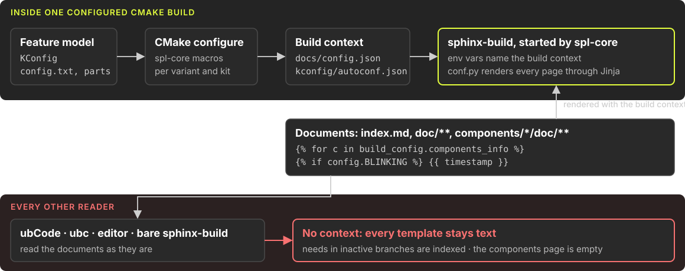
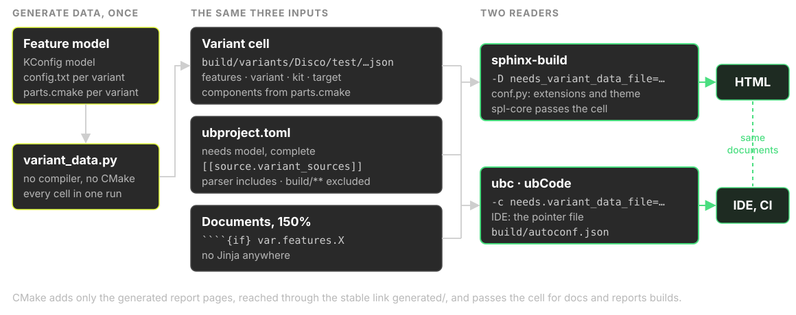

<!-- ─── TITLE SLIDE ─── -->

<!-- _class: invert title-slide -->
<!-- _paginate: false -->

## SPLed and spl-core

# Variant documentation without templates

<div class="title-divider"></div>

### useblocks GmbH · Munich, Germany

<div class="title-date">October 2026</div>

<!--
Audience: engineers who know Sphinx and sphinx-needs. Four parts: how upstream does it, why static readers fail, the fix, and what is still open. Everything shown is merged on the useblocks forks: SPLed#4, spl-core#5 and clanguru#1.
-->

---

<!-- _class: invert -->

<span class="badge">Agenda</span>

# Agenda

| # | Part | What it covers |
|:---:|:---|:---|
| **1** | **How upstream builds variant docs** | spl-core, Jinja, one CMake build |
| **2** | **Why ubCode and ubc cannot read it** | static readers, and the one rule they need |
| **3** | **The fix** | a generated selection, declarative gates, spl-core and clanguru changes |
| **4** | **What is still open** | next steps, product ideas, the way upstream |

<div class="note">Everything shown is merged on the forks: <a href="https://github.com/useblocks/SPLed/pull/4">useblocks/SPLed#4</a>, <a href="https://github.com/useblocks/spl-core/pull/5">useblocks/spl-core#5</a> and <a href="https://github.com/useblocks/clanguru/pull/1">useblocks/clanguru#1</a></div>

---

<!-- _class: invert -->

<span class="badge">Summary</span>

# In one slide

- **Today:** every document is a Jinja template, rendered inside a CMake build that alone knows the variant.
- **Problem:** readers that do not run the build, such as ubCode, ubc, an editor or a CI gate, see templates instead of documents.
- **Fix:** selecting a variant generates every file the readers need: the variant data, the rules and the selection. Sphinx and ubc read the same files.
- **Status:** merged on the useblocks forks. Both readers read the same needs, 134 against 132 in Disco's reports, the two untitled imports apart. The [CI documentation gate](https://github.com/useblocks/SPLed/actions/runs/36923824832) is green.

<div class="highlight">

**Key takeaway:** the documentation of a product line should be something a tool can read, not something only a build can produce.

</div>

<!--
If there is time for only one slide, this is it. The rest of the talk backs each line with code and evidence.
-->

---

<!-- _class: invert -->

<span class="badge">Context</span>

# SPLed, a product line in miniature

[SPLed](https://github.com/avengineers/SPLed) has one code base, five [variants](https://github.com/avengineers/SPLed/tree/f5ba89efcabb494ccc66a7619943260444c497de/variants) and two build kits. [spl-core](https://github.com/avengineers/spl-core) turns each variant into firmware, unit tests, coverage and documentation.

| Variant | Features switched on | Components |
|:---|:---|:---:|
| Disco | `BLINKING` | 11 |
| Sleep | `BRIGHTNESS_ADJUSTMENT_MANUAL`, `AUTO_OFF` | 13 |
| Spa | `BRIGHTNESS_ADJUSTMENT_AUTOMATIC` | 12 |
| IDEA/Sloemada | `BRIGHTNESS_ADJUSTMENT_MANUAL`, `AUTO_OFF` | 13 |
| Base/Dev | none, the KConfig defaults | 7 |

<div class="note">Every variant is a value for each of the 21 <a href="https://github.com/avengineers/SPLed/blob/f5ba89efcabb494ccc66a7619943260444c497de/KConfig">KConfig</a> features plus a component list in its <a href="https://github.com/avengineers/SPLed/blob/f5ba89efcabb494ccc66a7619943260444c497de/variants/Disco/parts.cmake">parts.cmake</a>. Component counts are the prod kit; the test kit adds an integration suite to Disco.</div>

---

<!-- _class: invert section-divider -->

<div class="section-number">01</div>

# How upstream builds variant documentation

### [avengineers/SPLed](https://github.com/avengineers/SPLed) and [spl-core 8.9.0](https://github.com/avengineers/spl-core/releases/tag/v8.9.0), as released

---

<!-- _class: invert -->

<span class="badge">Upstream today</span>

# Only a CMake build knows the variant



<div class="note">spl-core's <a href="https://github.com/avengineers/spl-core/blob/95a634771491f7c649566b06e3e1fed3f422d86b/src/spl_core/common.cmake#L650">common.cmake</a> starts sphinx-build with the build context · SPLed's <a href="https://github.com/avengineers/SPLed/blob/f5ba89efcabb494ccc66a7619943260444c497de/conf.py#L64-L81">conf.py</a> renders every page through Jinja</div>

<!--
spl-core's CMake writes a config.json per Sphinx target and the KConfig autoconf.json, then starts sphinx-build with environment variables that point at them. conf.py's source-read hook renders every page through Jinja with that context. A reader that is not this build has no context at all.
-->

---

<!-- _class: invert -->

<span class="badge">Upstream today</span>

# Every document is a template

<div class="columns">
<div>

````django


## {{ c.long_name or c.name }}

```{toctree}
/{{ c.path }}/doc/index

/{{ c.reports_output_dir }}/coverage

```


````

</div>
<div>

````django
```{mermaid}
stateDiagram-v2
    LIGHT_OFF --> LIGHT_ON
    LIGHT_ON --> LIGHT_OFF

    state LIGHT_ON {
        BlinkON --> BlinkOFF
        BlinkOFF --> BlinkON
    }

```
````

</div>
</div>

<div class="highlight">

**58 Jinja constructs in 6 of 18 documents.** The components page is a loop over CMake's component list; behaviour differences sit inside diagrams.

</div>

<div class="note">Shortened from <a href="https://github.com/avengineers/SPLed/blob/f5ba89efcabb494ccc66a7619943260444c497de/doc/components/index.md#L3-L20">doc/components/index.md</a> and <a href="https://github.com/avengineers/SPLed/blob/f5ba89efcabb494ccc66a7619943260444c497de/components/light_controller/doc/index.md#L106-L111">components/light_controller/doc/index.md</a></div>

<!--
Names are shortened to fit: component_info is c, and the mermaid transitions lose their labels. index.md adds the variant name and a {{ timestamp }}, which also makes every build unreproducible.
-->

---

<!-- _class: invert -->

<span class="badge">Upstream today</span>

# spl-core ships the Jinja pass

- [The kickstart template's `conf.py`](https://github.com/avengineers/spl-core/blob/95a634771491f7c649566b06e3e1fed3f422d86b/src/spl_core/kickstart/templates/project/conf.py#L71-L84) renders every page through Jinja. spl-core's [architecture notes](https://github.com/avengineers/spl-core/blob/95a634771491f7c649566b06e3e1fed3f422d86b/docs/internals/architecture/report_generation.md#L75-L84) call it "Rendering pages as Jinja templates".
- [`common.cmake`](https://github.com/avengineers/spl-core/blob/95a634771491f7c649566b06e3e1fed3f422d86b/src/spl_core/common.cmake#L650) passes the context as environment variables, and has clanguru wrap generated listings in [``](https://github.com/avengineers/spl-core/blob/95a634771491f7c649566b06e3e1fed3f422d86b/src/spl_core/common.cmake#L895-L900) so that C braces survive the pass.
- A new project starts with 32 Jinja constructs, for example on its [components page](https://github.com/avengineers/spl-core/blob/95a634771491f7c649566b06e3e1fed3f422d86b/src/spl_core/kickstart/templates/project/doc/components/index.md).

```python
def rstjinja(app, docname, source):
    source[0] = app.builder.templates.render_string(source[0], app.config.html_context)

def setup(app):
    app.connect("source-read", rstjinja)
```

<div class="note">Shortened from the <a href="https://github.com/avengineers/spl-core/blob/95a634771491f7c649566b06e3e1fed3f422d86b/src/spl_core/kickstart/templates/project/conf.py#L71-L84">kickstart template's conf.py</a>; <a href="https://github.com/avengineers/SPLed/blob/f5ba89efcabb494ccc66a7619943260444c497de/conf.py#L64-L81">SPLed's conf.py</a> has the same pass</div>

<!--
This is not a SPLed quirk. It is how every spl-core project is set up, which is why the fix has to start in spl-core.
-->

---

<!-- _class: invert section-divider -->

<div class="section-number">02</div>

# Why ubCode and ubc cannot read it

### Static readers, and the one rule they need

---

<!-- _class: invert -->

<span class="badge">The rule</span>

# ubCode and ubc read, never run

- They parse the documents and `ubproject.toml` directly: no CMake, no `conf.py`, no project Python.
- That makes them fast and safe: an IDE that updates as you type, a CI gate without a compiler, results that can be cached.
- It also makes them honest: what they report is what the sources say, not what one build happened to produce.

<div class="highlight">

**The rule:** whatever decides what a document contains must be data that every reader can see.

</div>

<div class="note"><a href="https://ubcode.useblocks.com/">ubCode</a> · <a href="https://github.com/useblocks/ubc-action">ubc in GitHub Actions</a></div>

<!--
Sphinx is a program that executes conf.py. ubCode and ubc are readers. Both have to arrive at the same document set, and they can only do that from the same data.
-->

---

<!-- _class: invert -->

<span class="badge">Why it fails</span>

# A template is text to a reader

- To a static reader, `` is a paragraph. Both branches are parsed.
- Needs inside an inactive branch enter the index, so traceability shows requirements the variant does not have.
- The rendered page and the file differ, so line numbers in warnings and need positions drift.
- Every brace in prose, code or diagrams is a hazard. Hence the `` armour on generated listings.

<!--
The Jinja pass also defeats Sphinx's own caching: every page is rewritten on every read, so nothing can be skipped.
-->

---

<!-- _class: invert -->

<span class="badge">Why it fails</span>

# The variant lives in the build

- The context arrives through environment variables that spl-core sets when it starts `sphinx-build`.
- A bare `sphinx-build` renders the components page empty, without a warning, and stops at the first stray brace.
- Upstream CI checks documentation only inside full variant builds. No job builds the documents without a compiler.
- An editor cannot show another variant without configuring and building it.

<div class="note">Upstream <a href="https://github.com/avengineers/SPLed/blob/f5ba89efcabb494ccc66a7619943260444c497de/.github/workflows/ci.yml">ci.yml</a>: gate selection, then Windows, Linux and devcontainer jobs that all run the build scripts</div>

---

<!-- _class: invert -->

<span class="badge">Why it fails</span>

# Generated pages have no stable name

```text
build/Disco/test/Debug/components/light_controller/reports/coverage.rst
build/Disco/test/Debug/reports/html/build/Disco/test/Debug/components/…/coverage/index.html
```

- Document names contain the variant, the kit and the build type, so a toctree can only reach the pages through a loop or a `/build/**` glob.
- gcovr writes each coverage report at the page's build-relative path. Move the page and its coverage link breaks.
- A reader that indexes `build/` sees every variant and kit ever built: the same need IDs, many times over.

<div class="note">spl-core writes the <a href="https://github.com/avengineers/spl-core/blob/95a634771491f7c649566b06e3e1fed3f422d86b/src/spl_core/common.cmake#L384">coverage link</a> relative to the page, and the <a href="https://github.com/avengineers/spl-core/blob/95a634771491f7c649566b06e3e1fed3f422d86b/src/spl_core/common.cmake#L624">gcovr tree</a> at the build-relative path</div>

---

<!-- _class: invert -->

<span class="badge">Why it fails</span>

# Two readers, two configurations

- The needs model is split between a [TOML file](https://github.com/avengineers/spl-core/blob/95a634771491f7c649566b06e3e1fed3f422d86b/src/spl_core/report_generation/ubproject.toml) inside the installed spl-core package and [`conf.py`](https://github.com/avengineers/SPLed/blob/f5ba89efcabb494ccc66a7619943260444c497de/conf.py#L56-L61).
- The `results` links come from [`sple_tr_link`](https://github.com/avengineers/spl-core/blob/95a634771491f7c649566b06e3e1fed3f422d86b/src/spl_core/report_generation/spl_sphinx.py#L69-L74), project Python that no static reader can execute.
- Upstream ships no `ubproject.toml`. [The fork's first one](https://github.com/useblocks/SPLed/blob/447b9e11621a44717ce5fca6339bc393f7e1b6ae/ubproject.toml#L3) extended a file inside the virtualenv, specific to one Python version and one OS.
- sphinx-needs does not implement ubCode's `extend`, so the two readers could not even share that file.

---

<!-- _class: invert section-divider -->

<div class="section-number">03</div>

# The fix: generate data, never content

### [SPLed#4](https://github.com/useblocks/SPLed/pull/4), with [spl-core#5](https://github.com/useblocks/spl-core/pull/5) and [clanguru#1](https://github.com/useblocks/clanguru/pull/1), merged on the forks

---

<!-- _class: invert -->

<span class="badge">The fix</span>

# Four rules

1. **One selection step** writes complete, self-describing data for every variant, kit and target, and the rules that gate the documents.
2. **Content stays 150 %** in the tree. Declarative gates decide what a variant contains.
3. **Every reader reads the same files:** the selection, its variant cell, `ubproject.toml` with its generated rules, and the documents.
4. **A variant is selected, not rendered:** CMake configure, or `tools/variant_data.py`, writes the selection; nothing is decided on a command line or in `conf.py`.

<div class="highlight">

Nothing that decides content lives in `conf.py`, CMake or a template, and nothing per component is written by hand.

</div>

---

<!-- _class: invert -->

<span class="badge">The fix</span>

# Both readers take the same inputs



<div class="note"><a href="https://github.com/useblocks/SPLed/blob/e79a759/tools/variant_data.py">tools/variant_data.py</a> writes the cells, the rules and the selection · <a href="https://github.com/useblocks/SPLed/blob/e79a759/ubproject.toml">ubproject.toml</a> holds the model and extends the rules · <a href="https://github.com/useblocks/SPLed/blob/e79a759/conf.py">conf.py</a> hands the selection to Sphinx</div>

<!--
Left: the selection step. Middle: the three inputs, all plain files. Right: the two readers. ubCode reaches the selection through extend; conf.py hands the same keys to Sphinx, whose extensions read one TOML file each. The CI gate checks that both arrive at the same needs.
-->

---

<!-- _class: invert -->

<span class="badge">The fix</span>

# One cell per variant, kit and target

<div class="columns">
<div>

```json
{
  "build_config": {
    "variant": "Sleep",
    "kit": "test",
    "target": "reports",
    "scope": "variant",
    "component": "",
    "components": ["components/rte", "…",
      "components/brightness_controller",
      "components/auto_off"]
  },
  "features": {
    "AUTO_OFF": true,
    "BLINKING": false,
    "BRIGHTNESS_ADJUSTMENT_ENABLED": true,
    "CUSTOMER": "B"
  }
}
```

</div>
<div>

- [`tools/variant_data.py`](https://github.com/useblocks/SPLed/blob/e79a759/tools/variant_data.py) writes all 114 cells in one run, without a compiler: 20 variant cells (5 variants, 2 kits, 2 targets) and 94 for per-component reports.
- Every declared boolean is present, including promptless ones that KConfig leaves out when they are off.
- The component list comes from `parts.cmake`, where the product structure already lives.
- `build/selection.toml` names the cell the IDE and a plain build read.

</div>
</div>

<!--
The features object is shortened: a cell has 21 features. scope and component make a per-component report a cell of its own. The selection is rewritten whenever CMake configures, or by a VS Code task, so the IDE follows the variant a developer is working on.
-->

---

<!-- _class: invert -->

<span class="badge">The fix</span>

# Two gates, one data source

```toml
# ubproject.variants.toml, generated: whole documents, gated on a component
[[source.variant_sources]]
if = "'components/auto_off' in var.build_config.components and (var.build_config.scope == 'variant' or var.build_config.component == 'components/auto_off')"
files = ["components/auto_off/**"]
```

<div class="columns">
<div>

`````text
% any document: blocks, gated on a feature
````{if} var.features.BLINKING
```{mermaid}
stateDiagram-v2
    state LIGHT_ON {
        BlinkON --> BlinkOFF
    }
```
````
`````

</div>
<div>

<div class="highlight">

**Membership, never identity:** gate on the component list, never on the variant name.

</div>

<div class="success">

12 generated rules and 28 `{if}` fences in 11 documents replace 58 Jinja constructs. The components page is a glob over every component.

</div>

</div>
</div>

<div class="note">The generator derives one rule per component from where its documentation lives · <a href="https://github.com/useblocks/SPLed/blob/e79a759/components/light_controller/doc/index.md">the light controller diagram</a> · <a href="https://sphinx-needs.readthedocs.io/en/latest/directives/if.html">the {if} directive</a> · <a href="https://github.com/useblocks/sphinx-mounts">sphinx-mounts</a> applies the rules for Sphinx</div>

<!--
Rules remove whole documents, for Sphinx through sphinx-mounts and for ubCode natively. Excluded toctree entries are reported as info by both tools. Content behind a false {if} is never parsed, so its needs never enter the traceability data. Adding a component means adding it to parts.cmake and writing its documentation: the next selection writes its rule.
-->

---

<!-- _class: invert -->

<span class="badge">The rule</span>

# No variants in toctrees

<div class="comparison">
<div class="comparison-before">

### A condition on a toctree entry

- `a if variant == 'a'` removes the entry, not the document
- the document is still read, and its needs still count
- no condition true: an orphan warning
- two conditions true: two parents, and no warning
- removing the document too needs a second pass or a toctree override

</div>
<div class="comparison-after">

### A rule on the document

- a false rule keeps the file out of discovery
- never read: no needs, no orphan
- the toctree stays static and lists all, 150 %
- an entry to a removed document is INFO, in Sphinx and ubCode
- Sphinx sees only `exclude_patterns` and a log filter

</div>
</div>

<div class="highlight">

**Discovery is the guest list, the toctree is the seating plan.** Sphinx fixes the guest list before it reads the first toctree.

</div>

<div class="note">Sphinx 8.2.3: <a href="https://github.com/sphinx-doc/sphinx/blob/v8.2.3/sphinx/project.py#L49-L62">discovery</a> · <a href="https://github.com/sphinx-doc/sphinx/blob/v8.2.3/sphinx/directives/other.py#L151-L161">entries to excluded documents</a> · <a href="https://github.com/sphinx-doc/sphinx/blob/v8.2.3/sphinx/environment/__init__.py#L799-L817">orphans</a> · <a href="https://github.com/sphinx-doc/sphinx/blob/v8.2.3/sphinx/environment/__init__.py#L879-L898">two parents</a> · sphinx-mounts 0.2.0: <a href="https://github.com/useblocks/sphinx-mounts/blob/0.2.0/src/sphinx_mounts/extension.py#L1001-L1003">rules become exclude_patterns</a>, <a href="https://github.com/useblocks/sphinx-mounts/blob/0.2.0/src/sphinx_mounts/warnings.py#L25-L29">entries become INFO</a></div>

<!--
The question came up as a feature request: conditions on toctree entries. Sphinx's order of work answers it. Discovery collects every file with a source suffix, minus exclude_patterns, before a single document is opened. Every discovered document is read, and sphinx-needs collects its needs while reading. A toctree only records that A lists B and C. So a condition on an entry moves the navigation, never the content: the document is still read, still contributes needs, and without a parent it is an orphan warning. With two true conditions it has two parents, which Sphinx reports only as INFO.
The one real case is a document in every variant whose place changes. Two thin pages at fixed places, one behind a rule and one behind its negation, both include the shared content from a folder outside discovery. The negation guarantees exactly one page per variant; two independent conditions could both be false and drop the content without a warning.
-->

---

<!-- _class: invert -->

<span class="badge">Proof</span>

# No toctree variants left in SPLed

- **Components:** [one glob toctree](https://github.com/useblocks/SPLed/blob/e79a759/doc/components/index.md) lists them all, and the generated rules decide which exist.
- **Reports:** `{if}` blocks on the build shape, `target == "reports"`. Each hides a whole report section in a docs build, not single entries.
- **The entries no longer vary.** Upstream computes them per entry; the fork globs the one build the selection reads:

```text
/{{ component_info.reports_output_dir }}/unit_test_results    upstream: Jinja, per entry
/build/**/components/light_controller/reports/unit_test_results   fork: one page, in every variant
```

<div class="highlight">

**Still required? No.** No document in SPLed changes its place by variant. If one ever does: two thin pages at fixed places, behind a rule and its negation, that include the same content.

</div>

<div class="note">Upstream <a href="https://github.com/avengineers/SPLed/blob/f5ba89efcabb494ccc66a7619943260444c497de/doc/components/index.md#L12-L16">components page</a> · fork <a href="https://github.com/useblocks/SPLed/blob/e79a759/components/light_controller/doc/index.md">report section</a></div>

<!--
The glob resolves to exactly one page because each reader reads one build's pages: the selection names them as the rst parser's include. The pages keep the names spl-core gives them, so the coverage links next to them work unchanged. The variant's own coverage page needs one pattern per depth, because a two-segment variant name such as Base/Dev puts it one level deeper.
-->

---

<!-- _class: invert -->

<span class="badge">The fix</span>

# One file selects the variant

```toml
# build/selection.toml, written by CMake configure or tools/variant_data.py
[needs]
variant_data_file = ".../build/variants/Disco/test/reports.json"

[parse.parsers.rst]   # this build's generated pages, where spl-core writes them
include = ["build/Disco/test/Debug/components/**/*.rst", "…/test/**/*.rst", "…/reports/*.rst"]
```

- ubCode reaches it through `extend`; `conf.py` hands the same keys to Sphinx. Nothing is selected on a command line.
- Every build keeps one such file per documentation run: `sphinx-build -D spl_selection=<file>`, `ubc check -c "$(cat <file>)"`.
- No link, no copy, no mount: two builds' reports run side by side.

<div class="note"><a href="https://github.com/useblocks/SPLed/blob/e79a759/tools/variant_data.py">the generator</a> · <a href="https://github.com/useblocks/SPLed/blob/e79a759/conf.py">conf.py</a> · <a href="https://github.com/useblocks/spl-core/blob/ce62088/docs/reference/variables.md">SPL_SPHINX_OPTIONS</a> names each run's file</div>

<!--
The first design selected the variant with one key on the command line and reached the generated pages through a link called generated. The link was a cross-platform problem, blocked parallel builds, and ubCode never followed it. Reading the pages in place, named by the selection, removed all three.
-->

---

<!-- _class: invert -->

<span class="badge">The fix</span>

# Changes in spl-core and clanguru

| New in spl-core | Default | What a project can do |
|:---|:---|:---|
| `KConfig.declared_boolean_symbols()` | a function | list every declared boolean |
| `SPL_SOURCE_DOCS_JINJA_RAW_TAGS` | `ON` | listings without `` |
| `SPL_VARIANT_DATA_FILE_DOCS`, `_REPORTS` | empty | give each Sphinx build its cell |
| `SPL_SPHINX_SOURCE_DIR` | project root | Sphinx on a folder of its own |
| `SPL_SPHINX_OPTIONS`, `_COMPONENT_OPTIONS` | empty | each run its own selection file |
| `SPL_TEST_RESULTS_AS_NEEDS` | `OFF` | test results as needs.json |

- **clanguru:** a listing shows only its file's own declarations, parsed with every preprocessor option. Before, Spa's report listed a manual-brightness test instead of the automatic ones Spa runs.

<div class="note"><a href="https://github.com/useblocks/spl-core/pull/5">useblocks/spl-core#5</a> · <a href="https://github.com/useblocks/clanguru/pull/1">useblocks/clanguru#1</a>, proposed upstream as <a href="https://github.com/cuinixam/clanguru/pull/9">cuinixam/clanguru#9</a> · <a href="https://github.com/useblocks/spl-core/blob/ce62088/docs/reference/variables.md">variables reference</a></div>

---

<!-- _class: invert -->

<span class="badge">The fix</span>

# What SPLed no longer needs

<div class="comparison">
<div class="comparison-before">

### Upstream

- 58 Jinja constructs in 6 documents
- a `source-read` handler that renders every page
- report entries built from Jinja paths
- test results through a Sphinx-only directive and a Python link function
- no documentation check without a full variant build
- no variant data a static reader can use

</div>
<div class="comparison-after">

### Now

- no Jinja in any document
- no `source-read` handler; [`conf.py`](https://github.com/useblocks/SPLed/blob/e79a759/conf.py) hands the selection on
- report entries as globs over the one selected build
- test results as needs.json, imported by both readers
- every variant and kit checked by both readers on every PR
- 114 variant cells, generated rules and a selection

</div>
</div>

<div class="note"><a href="https://github.com/useblocks/SPLed/pull/4">useblocks/SPLed#4</a>, which carries the earlier SPLed#2 and #3</div>

---

<!-- _class: invert -->

<span class="badge">Proof</span>

# Both readers agree, need for need

- **The gate:** every variant and kit, every per-component report, and the test kit's reports, built by `sphinx-build -W` and by ubc; their needs.json compared on IDs, types, titles, fields and links.
- **Allowed differences** are listed with their reason: `REQ_37` and `REQ_58`, untitled in the ubConnect export, and `remote-url`, which the readers store differently.
- **End to end:** Disco's reports have working coverage links and every relative link resolves: 7,848 of 7,848.

<div class="kpi-grid-4">
<div class="kpi-tile"><div class="kpi-number">134 / 132</div><div class="kpi-label">needs, Sphinx / ubc</div><div class="kpi-sublabel">Disco reports, 0 field differences</div></div>
<div class="kpi-tile"><div class="kpi-number">25 / 25</div><div class="kpi-label">one component's report</div><div class="kpi-sublabel">light_controller</div></div>
<div class="kpi-tile"><div class="kpi-number">95</div><div class="kpi-label"><a href="https://github.com/useblocks/SPLed/actions/runs/36923824832">CI documentation gate</a></div><div class="kpi-sublabel">passed</div></div>
<div class="kpi-tile"><div class="kpi-number">3 / 4</div><div class="kpi-label">CI jobs green</div><div class="kpi-sublabel">Windows fails installing the toolchain, as on upstream develop</div></div>
</div>

---

<!-- _class: invert -->

<span class="badge">Lesson learned</span>

# A trap only a second reader would find

- [Upstream's lock refresh](https://github.com/avengineers/SPLed/commit/f5ba89efcabb494ccc66a7619943260444c497de) moved sphinx-needs from 8.2 to 8.5.
- 8.5 resolves the variant data right after it loads `ubproject.toml`, before the handler in `conf.py` ran.
- Every reports build read the docs cell and silently lost its report sections, or failed on a fresh checkout.
- The documentation gate caught it when [upstream was merged](https://github.com/useblocks/SPLed/commit/f4f98a57913d15fa45fe39c073c9bdbad1c03a2f). Today the selection is a generated file that `conf.py` hands on before sphinx-needs loads its TOML.

<div class="warn">

A selection that lives in one reader's code breaks without a sound. A selection that is data, or a standard override, cannot.

</div>

---

<!-- _class: invert -->

<span class="badge">Lesson learned</span>

# What the second reader found

- **Generated pages missing in ubCode:** ubc read 92 of Sphinx's 134 needs while the pages came in through a mount inside the project. All 42 missing ones were on the verification side. Reading the pages in place closed it.
- **Wrong code in the listings:** clanguru dropped `-isystem`, so every listing showed the `#ifdef` branch of "no feature defined". Spa's report listed `TS_BC-001` instead of `TS_BC-002`/`003`.
- **A link rule only Sphinx knew:** sphinx-codelinks adds it in Python, so ubCode showed the source URL as plain text.

<div class="warn">

Each one looked fine in one reader. The comparison need by need is what made them visible.

</div>

---

<!-- _class: invert section-divider -->

<div class="section-number">04</div>

# What can still be improved

### In the repositories, in ubCode and ubc, and on the way upstream

---

<!-- _class: invert -->

<span class="badge">Still open</span>

# Next in SPLed and spl-core

- **Comparing variants without reconfiguring:** codelinks reads one compile database, the selected build's. One per build, named by each selection, makes a comparison two ubc runs. To discuss: switch off `-save-temps` in spl-core, or let codelinks keep only the preprocessor options.
- **Windows CI:** the toolchain install fails, on the fork and on upstream `develop` alike.
- **A folder for the documents:** move them into `docs/`. The [spl-core setting](https://github.com/useblocks/spl-core/commit/998c97d59a41058ef937ef12c191d19216a72c2c) is ready.
- **The kickstart template:** start new spl-core projects without [the Jinja pass](https://github.com/avengineers/spl-core/blob/95a634771491f7c649566b06e3e1fed3f422d86b/src/spl_core/kickstart/templates/project/conf.py#L71-L84).
- **Upstream data:** titles for `REQ_37` and `REQ_58` in the ubConnect export.

---

<!-- _class: invert -->

<span class="badge">Still open</span>

# What would help in ubCode, ubc and codelinks

- **Consistent overrides:** `-c` replaces the whole rule array but appends to `extend_exclude`.
- **Globs and includes:** an include without a slash matches at any depth while `/index.md` matches nothing; an empty toctree glob warns, which forces one `{if}` per depth.
- **One value for both readers:** sphinx-codelinks stores the path in `remote-url`, ubCode the URL; in a git worktree Sphinx's link has no commit.
- **Compile commands:** keep only the preprocessor options, as clanguru now does, so `-save-temps` stops costing a file its needs.
- **Parity as a feature:** a ubc check that compares its needs with a Sphinx build, like SPLed's gate.

---

<!-- _class: invert -->

<span class="badge">Still open</span>

# Getting it upstream

1. **clanguru:** [cuinixam/clanguru#9](https://github.com/cuinixam/clanguru/pull/9) is open with the two fixes. Release.
2. **spl-core:** propose the changes to [avengineers/spl-core](https://github.com/avengineers/spl-core) from a clean branch. Release.
3. **SPLed:** propose to [avengineers/SPLed](https://github.com/avengineers/SPLed) with both pins moved to PyPI releases, after deciding whether the fork's own 21 commits (customer content, CSV import, codelinks) go along.

<div class="highlight">

Until then, SPLed pins merge commits on the forks' default branches, so every machine and every CI job builds the same code.

</div>

---

<!-- ─── CLOSING SLIDE ─── -->

<!-- _class: invert closing-slide -->
<!-- _paginate: false -->

# One source, two readers, one answer

<div class="title-divider"></div>

### Questions? Let's talk.

<div class="closing-contact">
<strong>SPLed</strong> · <a href="https://github.com/useblocks/SPLed/pull/4">useblocks/SPLed#4</a><br>
<strong>spl-core</strong> · <a href="https://github.com/useblocks/spl-core/pull/5">useblocks/spl-core#5</a> · <strong>clanguru</strong> · <a href="https://github.com/useblocks/clanguru/pull/1">useblocks/clanguru#1</a><br>
<strong>CI</strong> · <a href="https://github.com/useblocks/SPLed/actions/runs/36923824832">the documentation gate, green</a>
</div>
